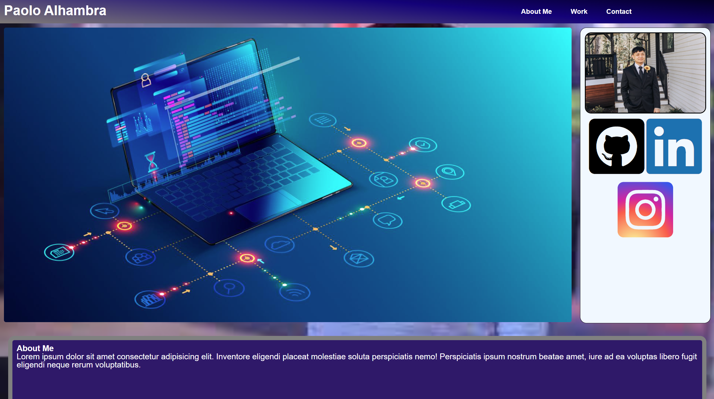

# Paolo's portfolio

## Description

This project was to create our own portfolio from scratch. Using procedures like wireframing and referencing examples, I had idea on how I could format my portfolio. Throughout this class, I will be able to update the placeholders used in my "work" section with actual screenshots of real work and projects. 

Note: I have not created a Linkedin profile, so the link will take you to the homepage. I will update the link when the profile has been made.

https://palhambra.github.io/Paolos-portfolio/
